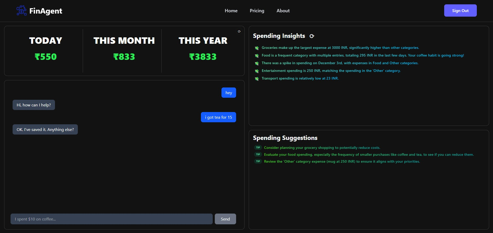
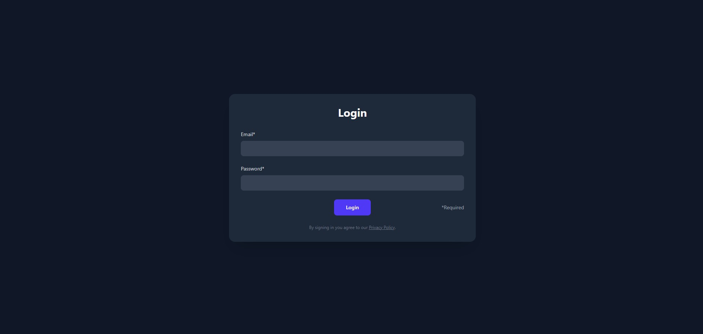
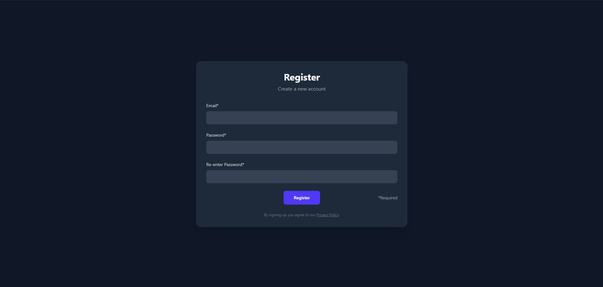

# FinAgent - AI-Powered Financial Assistant

An intelligent full-stack financial management platform that replaces traditional static expense forms with conversational AI. Built to showcase modern web development skills combining FastAPI backends, React frontends, LangGraph AI agents, and real-time data visualization.

## 🎯 Project Overview

FinAgent transforms expense tracking into natural conversations. Users chat with an AI agent that extracts financial data, stores transactions, generates personalized spending insights, and visualizes patterns through interactive dashboards.

## 🏗️ Architecture

Frontend (React + Vite + Tailwind)

FastAPI Backend
JWT Auth Middleware
LangGraph Agent Engine
Database Layer (SQLAlchemy)
LLM Integration (Claude/OpenAI)

PostgreSQL Database

## ✨ Key Features

- **Conversational Expense Logging**: Natural language input replaces manual forms - "I got tea for 15" automatically creates transactions.
- **AI-Powered Insights**: Real-time spending analysis with personalized recommendations based on category patterns.
- **Interactive Dashboard**: Visual spending breakdowns by category with daily/monthly/yearly views.
- **Smart Categorization**: AI automatically categorizes expenses (Groceries, Food, Transport, Entertainment).
- **Secure Authentication**: JWT-based user authentication with protected routes.

## 📊 Application Screenshots

### Dashboard & AI Insights
The main dashboard displays real-time spending totals, AI-generated insights, and budget suggestions.

### Secure Authentication
Secure login and signup pages with JWT-based session management.

| Login Page | Signup Page |
| :---: | :---: |
|  |  |

## 🛠️ Tech Stack

**Backend**
- FastAPI (Python web framework)
- SQLAlchemy (ORM)
- Pydantic (Data validation)
- LangGraph (AI agent workflows)
- PostgreSQL/MongoDB (Database)

**Frontend**
- React 18 with Vite
- Tailwind CSS
- Recharts (Data visualization)
- React Router (Navigation)

**AI/ML**
- LangChain/LangGraph (Agent framework)
- Claude/OpenAI APIs (LLM integration)
- Custom prompt engineering for financial data extraction

**DevOps**
- Docker (Containerization)
- AWS EC2 (Hosting)
- JWT (Authentication)

